# Práctica 4.4 (semana del 23 al 27 Enero): deployment of an architecture EFS-EC2-MultiAZ in the CLoud (AWS)

## Pasos a seguir:

1. Nos vamos a la ec2 y le damos a grupos de seguridad para posteriormente crear el grupo web con el puerto 80 y el sgweb con el puerto 2049

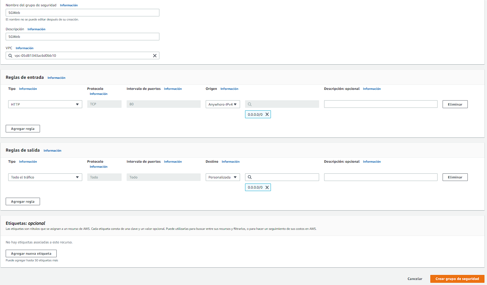

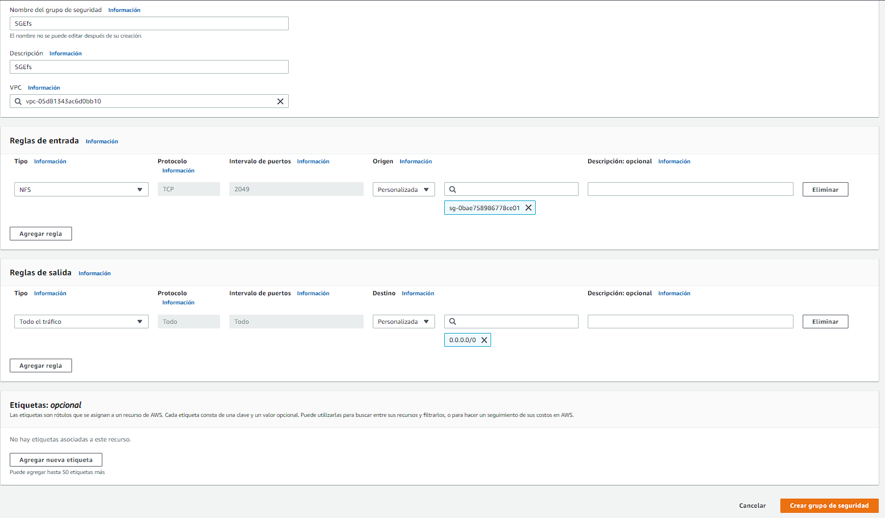

    1.1 En el grupo de seguridad SGWeb añadiremos la siguiente regla de entrada

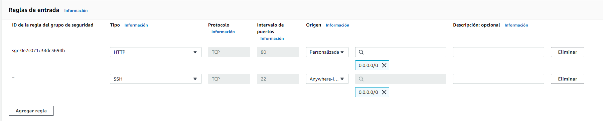

2. Ahora lanzaremos una instancia

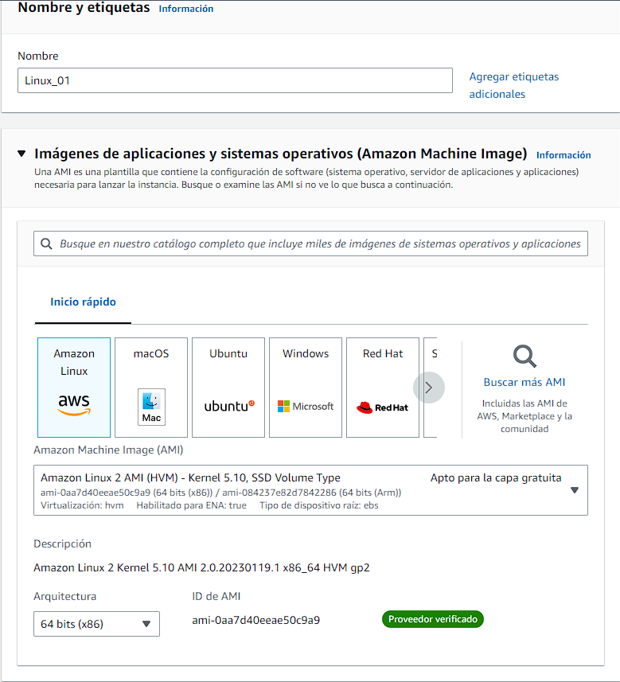

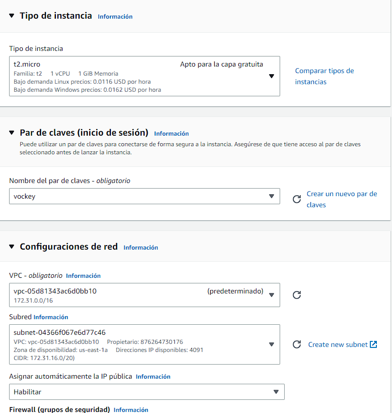

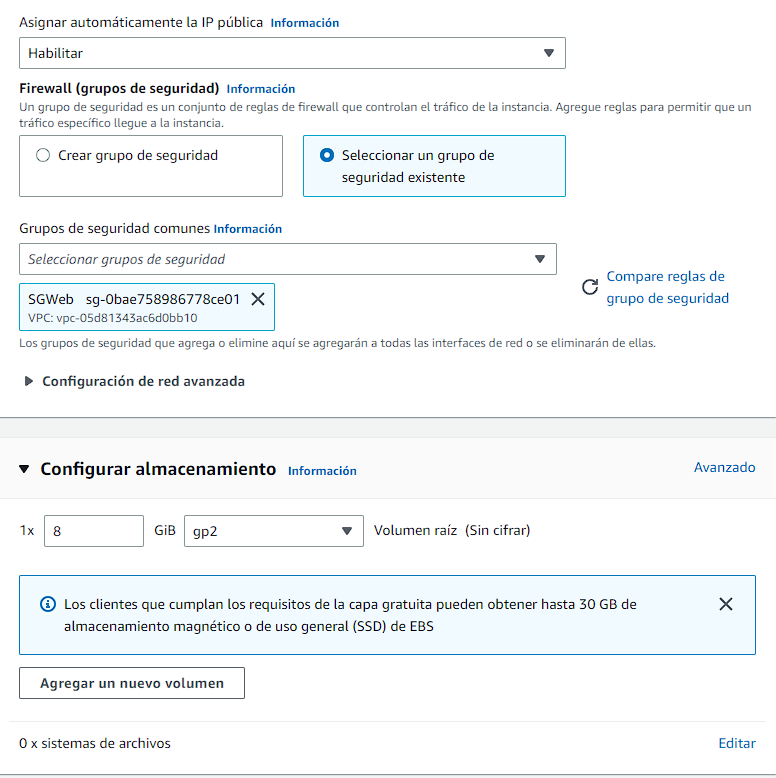

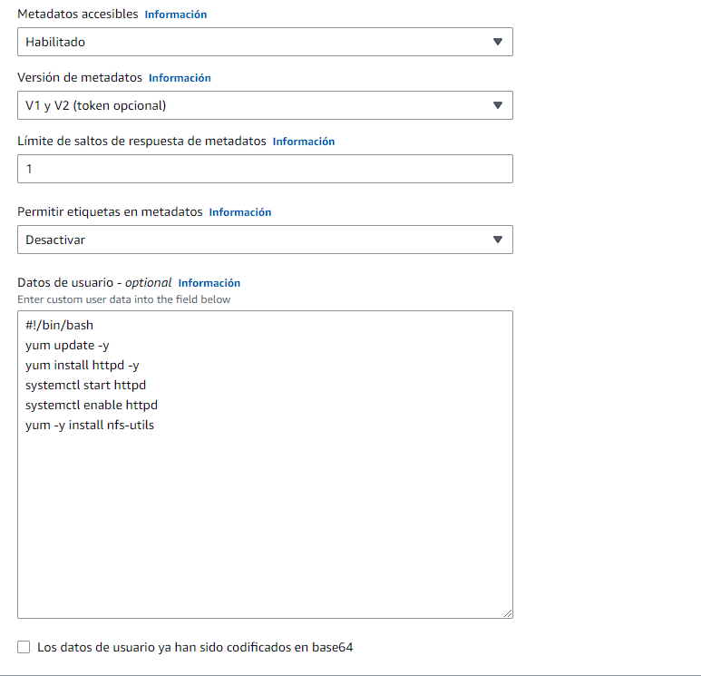

3. lanzaremos otra identica aunque le cambiaremos lo siguiente

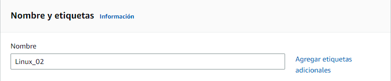

4. Ahora montaremos el servicio nfs

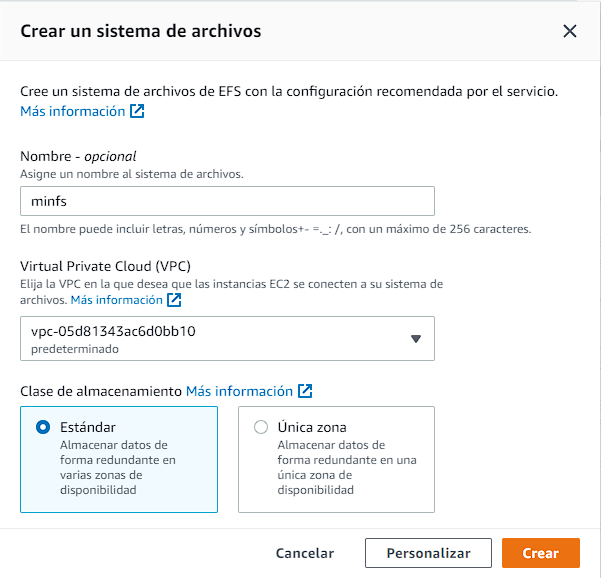

    4.1 Accedemos al nfs y le damos a el apartado de red y le damos a administrar.
    Y en la zona 1a y 1b elegimos el siguiente grupo de seguridad, ya que son las únicas que vamos a usar.

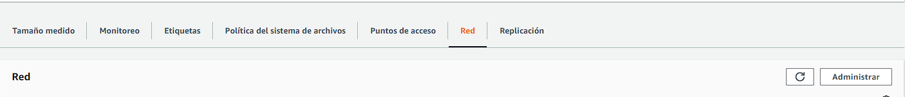

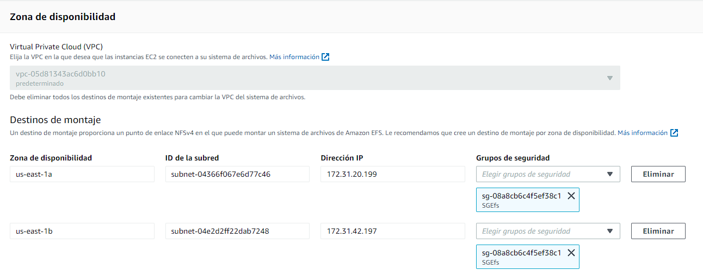

Copiaremos el id en el notepad para usarlo mas tarde y no tener que ir buscandolo.

5. Nos conectamos a las máquinas ec2.

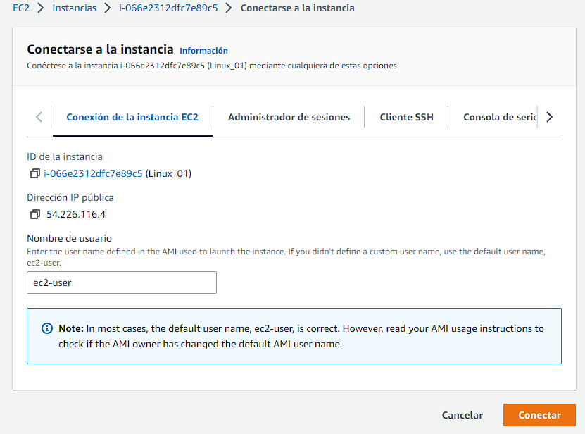

6. Nos vamos a la carpeta var/www/html con el siguiente comando y creamos la siguiente carpeta con este comando.

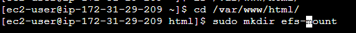

7. Podremos el siguiente comando, pero tendremos que cambiar el id que nos viene por el id de nuestro nfs que guardamos antes.

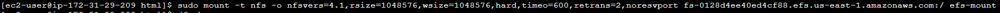

8. Ahora meteremos nuestros archivos de la página web mediante una url. Tabien descomprimiremos la carpeta netflix.zip con el siguiente comando

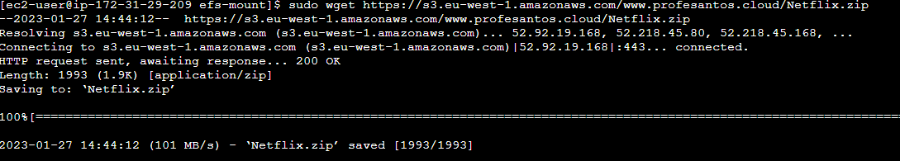

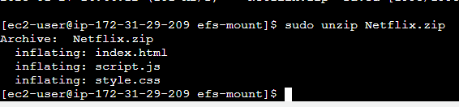

9. Hacemos exactamente lo mismo en la otra máquina ec2, lo único que no haremos es descomprimir la carpeta netflix.zip

10. Ahora modificaremos el fichero httpd.conf para en el buscador nos salga la pagina de netflix solamente poniendo la ip

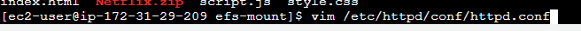

11. Ahora cambiaremos el documentRoot para que redirija a la carpeta efs-mount. Y reiniciamos el apache:

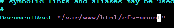

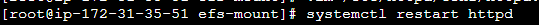
