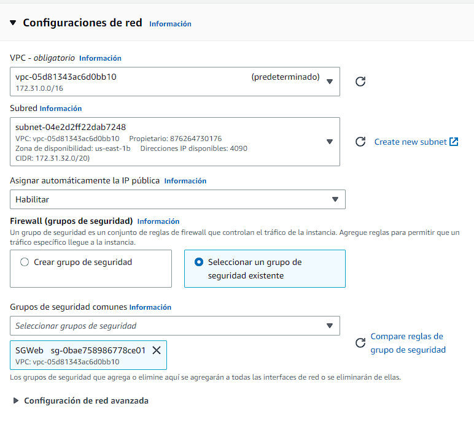

# Práctica 4.4 (semana del 23 al 27 Enero): deployment of an architecture EFS-EC2-MultiAZ in the CLoud (AWS)


## Pasos a seguir:

1. Nos vamos a la ec2 y le damos a grupos de seguridad para posteriormente crear el grupo web con el puerto 80 y el sgweb con el puerto 2049


    1.1 En el grupo de seguridad SGWeb añadiremos la siguiente regla de entrada


2. Ahora lanzaremos una instancia


3. lanzaremos otra identica aunque le cambiaremos lo siguiente




4. Ahora montaremos el servicio nfs


    4.1 Accedemos al nfs y le damos a el apartado de red y le damos a administrar.
    Y en la zona 1a y 1b elegimos el siguiente grupo de seguridad, ya que son las únicas que vamos a usar.


Copiaremos el id en el notepad para usarlo mas tarde y no tener que ir buscandolo.

5. Nos conectamos a las máquinas ec2.


6. Nos vamos a la carpeta var/www/html con el siguiente comando y creamos la siguiente carpeta con este comando.


7. Podremos el siguiente comando, pero tendremos que cambiar el id que nos viene por el id de nuestro nfs que guardamos antes.


8. Ahora meteremos nuestros archivos de la página web mediante una url. Tabien descomprimiremos la carpeta netflix.zip con el siguiente comando


9. Hacemos exactamente lo mismo en la otra máquina ec2, lo único que no haremos es descomprimir la carpeta netflix.zip

10. Ahora modificaremos el fichero httpd.conf para en el buscador nos salga la pagina de netflix solamente poniendo la ip


11. Ahora cambiaremos el documentRoot para que redirija a la carpeta efs-mount. Y reiniciamos el apache:


## Crear balanceador

1. Crearemos la ec2.

- Todos los ajustes por defecto exceptuando los siguientes:
- SO Ubuntu 22.04 LTS
- Par de claves: vockey
- Configuracion de red -> Permitir Trafico HTTP desde Internet

2. Nos conectaremos y pondremos los siguientes comandos.

    ```
    sudo su

    apt-get update

    apt install apache2

    a2enmod proxy

    a2enmod proxy_http

    a2enmod proxy_ajp

    a2enmod rewrite

    a2enmod deflate

    a2enmod headers

    a2enmod proxy_balancer

    a2enmod proxy_connect

    a2enmod proxy_html

    a2enmod lbmethod_byrequests

    systemctl restart apache2
    ```

3. Ahora introduciremos el siguiente comando

    `sudo nano /etc/apache2/sites-enabled/000-default.conf`

4. Añadiremos este codigo cambiando en #Server1 y # Server2 por nuestra IP

    ```
    <Proxy balancer://mycluster> 
    # Server 1 BalancerMember http://ip-http-server-1/ *IP PRIVADA*
    # Server 2 BalancerMember http://ip-http-server-2/ *IP PRIVADA* </Proxy> ProxyPass / balancer://mycluster/

    ProxyPassReverse "/images/" "balancer://myset/"

    <Location "/balancer-manager"> SetHandler balancer-manager Require host localhost </Location>

    <Location /balancer-manager> SetHandler balancer-manager Order Deny,Allow Allow from all </Location>

    ProxyPass /balancer-manager !
    ```

5. Reiniciaremos apache

    `systemctl restart apache2`

## Securizar y configurar los archivos y la BD

1. Para mas comodidad crearemos 3 ips elásticas para cada ec2 incluyendo el cluster para que nuestra ip sea fija.

2. Cambiaremos las de entrada del SGWeb para que solo pueda acceder el balanceador y así que sea más seguro


3. Instalaremos php en ambas ec2 tanto en Linux_1 como Linux_2 para poder usar los archivos php siguientes.
    ```
    sudo apt-get update && sudo apt-get upgrade
    sudo apt-get install php
    sudo apt install software-properties-common
    sudo add-apt-repository ppa:ondrej/php
    sudo apt-get update
    sudo apt install php8.0
    ```

4. Crearemos una BBDD con la siguiente configuración


5. Crearemos los siguientes archivos y modificaremos los que ya teniamos.

Nos iremos a la siguiente ruta /var/www/html/efs-mount y crearemos/modificaremos los siguientes archivos.

    1. index.html

    <html lang="en">
    <head>
    <meta charset="UTF-8" />
    <meta name="viewport" content="width=device-width, initial-scale=1.0" />
    <link rel="stylesheet" href="style.css" />
    <title>Movie App</title>
    </head>
    <body>
    <header>
      <form id="form">
        <input type="text" id="search" class="search" placeholder="Search">
      </form>
    </header>
        <form action="formulario.php">
    <input class="boton_personalizado" type="submit" value="Donativos Turquia y Siria " />
    </form>
    <main id="main"></main>

    <script src="script.js"></script>
    </body>
    </html>

    2. style.css(Añadiremos las siguientes lineas)

    .form {
    width: 100%;
    max-width: 600px;
    margin: 0 auto;
    display: flex;
    flex-direction: column;
    justify-content: center;
    align-items: center;
    }

    .form input {
    width: 90%;
    height: 30px;
    margin: 0.5rem;
    }

    .form button {
    padding: 0.5em 1em;
    border: none;
    background: rgb(100, 200, 255);
    cursor: pointer;
    }

    .center {
    margin: auto;
    width: 50%;
    border: 3px solid green;
    padding: 10px;
    }

    .boton_personalizado{
        text-decoration: none;
        padding: 10px;
        font-weight: 600;
        font-size: 20px;
        color: #ffffff;
        background-color: transparent;
        border-radius: 0px;
        border: 2px solid #EDD8D8;
    }

    .boton_personalizado:hover{
        color: #EDD8D8;
        background-color: transparent;
    }

    3. conexion.php

    <?php
    $servername = "cluster.cgwpls0iugc9.us-east-1.rds.amazonaws.com";
    $username = "admin";
    $password = "Root1234$";
    $bd="Cluster";
    try {
        $conn = new PDO("mysql:host=$servername;dbname=$bd", $username, $password);
    } catch (PDOException $pe) {
        die("Could not connect to the database $dbname :" . $pe->getMessage());
    }
    try {
        $conn = new PDO("mysql:host=$servername;dbname=$bd", $username, $password);
    } catch (PDOException $pe) {
        die("Could not connect to the database $dbname :" . $pe->getMessage());
    }
    ?>

    4. grabar.php

    <html>
    <head>
    <meta charset="UTF-8" />
        <meta name="viewport" content="width=device-width, initial-scale=1.0" />
        <link rel="stylesheet" href="style.css" />
    </head>
    <body>
    <header>
        <form id="form">
            <input type="text" id="search" class="search" placeholder="Search">
        </form>
        </header>
    <main id="main">
    <?php
    include ('conexion.php');
    $nombre=$_REQUEST['nombre'];
    $donativo=$_REQUEST['donativo'];
    $tipomoneda=$_REQUEST['tipomoneda'];
    $data = [
        'nombre' => $nombre,
        'donativo' => $donativo,
        'tipomoneda' => $tipomoneda,
    ];
    $sql = "INSERT INTO donativos VALUES (null,:nombre, :donativo, :tipomoneda)";
    $stmt= $conn->prepare($sql);
    $stmt->execute($data);
    echo "<div class='center'>";
    echo "<h2> Has colaborado con ". $donativo. "  " . $tipomoneda."</h2>" ;
    echo "<h2> Donacion registrada correctamente. Gracias por su colaboracion </h2>";
    echo "<h2><a href='index.html' > Volver a Inicio </a></h2>";
    echo "</div>";
    echo "<div class='center' style='font-size:25px;color: #FF0000'>";
    $sql = 'SELECT sum(donativo) as total from donativos;';
        foreach ($conn->query($sql) as $row) {
            echo "TOTAL RECAUDADO ".$row['total'] . "\n";
        }
    echo "</div>";
    ?>
    </main>
    </body>
    </html>

    5. formulario.php

    <html>
    <head>
    <meta charset="UTF-8" />
        <meta name="viewport" content="width=device-width, initial-scale=1.0" />
        <link rel="stylesheet" href="style.css" />
    </head>
    <body>
    <header>
        <form id="form">
            <input type="text" id="search" class="search" placeholder="Search">
        </form>
    </header>
    <main id="main">
    <form action="grabar.php" method="post" class="form">

        <label ><h1> DONATIVOS PARA TURQUIA Y SIRIA </h1></label>
        <label for="name">Nombre :</label>
        <input type="text" id="nombre" name="nombre">
        <br>
            <label for="donativo">Donativo: </label>
        <input type="donativo" id="donativo" name="donativo">
        <br>

        <input type="radio" name="tipomoneda" value="euro" checked > Euros <br>

        <input type="radio" name="tipomoneda" value="dolar"> Dolares <br>
        <br>
    <input type="submit" value ="Enviar" name="enviar" />


    </form>

6. Ahora securizaremos todo para que quede lo mas seguro posible

- SGMySql
